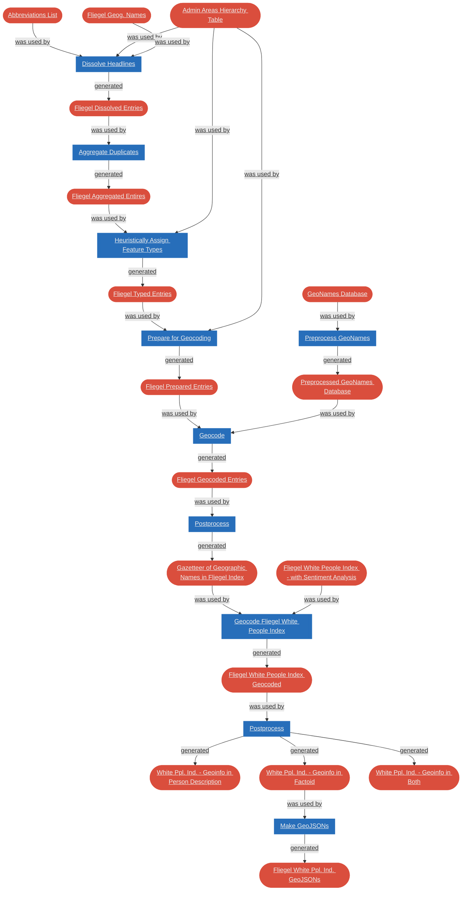

```mermaid
flowchart TD
classDef entity fill:#DA4E3DFF
classDef entity color:#eee
classDef entity stroke:#DA4E3DFF
classDef entity stroke-width:1px
classDef activity fill:#276EBAFF
classDef activity color:#eee
classDef activity stroke:#276EBAFF
classDef activity stroke-width:1px
classDef agent fill:#ffebc3
classDef agent color:#000000
classDef agent stroke:#a4a4a4
classDef agent stroke-width:1px
https://github.com/rue-a/fliegel/tree/master/interim/fliegel_geog_names.csv([<a style=color:inherit href=https://github.com/rue-a/fliegel/tree/master/interim/fliegel_geog_names.csv>Fliegel Geog. Names</a>]):::entity
https://github.com/rue-a/fliegel/tree/master/admin_codes/admin_levels.csv([<a style=color:inherit href=https://github.com/rue-a/fliegel/tree/master/admin_codes/admin_levels.csv>Admin Areas Hierarchy Table</a>]):::entity
https://github.com/rue-a/fliegel/tree/master/misc/abbreviations.csv([<a style=color:inherit href=https://github.com/rue-a/fliegel/tree/master/misc/abbreviations.csv>Abbreviations List</a>]):::entity
https://github.com/rue-a/fliegel/tree/master/interim/fliegel_schematized.csv([<a style=color:inherit href=https://github.com/rue-a/fliegel/tree/master/interim/fliegel_schematized.csv>Fliegel Dissolved Entries</a>]):::entity
https://github.com/rue-a/fliegel/tree/master/03_headlines_into_schema.py-- <a style=color:inherit href=https://www.w3.org/TR/prov-o/#wasGeneratedBy>generated</a> -->https://github.com/rue-a/fliegel/tree/master/interim/fliegel_schematized.csv
https://github.com/rue-a/fliegel/tree/master/interim/fliegel_condensed.csv([<a style=color:inherit href=https://github.com/rue-a/fliegel/tree/master/interim/fliegel_condensed.csv>Fliegel Aggregated Entires</a>]):::entity
https://github.com/rue-a/fliegel/tree/master/04_condense_duplicates.py-- <a style=color:inherit href=https://www.w3.org/TR/prov-o/#wasGeneratedBy>generated</a> -->https://github.com/rue-a/fliegel/tree/master/interim/fliegel_condensed.csv
https://github.com/rue-a/fliegel/tree/master/interim/fliegel_typed.csv([<a style=color:inherit href=https://github.com/rue-a/fliegel/tree/master/interim/fliegel_typed.csv>Fliegel Typed Entries</a>]):::entity
https://github.com/rue-a/fliegel/tree/master/05_apply_heuristics.py-- <a style=color:inherit href=https://www.w3.org/TR/prov-o/#wasGeneratedBy>generated</a> -->https://github.com/rue-a/fliegel/tree/master/interim/fliegel_typed.csv
https://download.geonames.org/export/dump/46df5fcf-a334-4f0d-b386-883c71a9bd11([<a style=color:inherit href=https://download.geonames.org/export/dump/46df5fcf-a334-4f0d-b386-883c71a9bd11>GeoNames Database</a>]):::entity
https://github.com/rue-a/fliegel/tree/master/geonames/geonames_prepared.csv([<a style=color:inherit href=https://github.com/rue-a/fliegel/tree/master/geonames/geonames_prepared.csv>Preprocessed GeoNames Database</a>]):::entity
https://github.com/rue-a/fliegel/tree/master/06_prepare_geonames.py-- <a style=color:inherit href=https://www.w3.org/TR/prov-o/#wasGeneratedBy>generated</a> -->https://github.com/rue-a/fliegel/tree/master/geonames/geonames_prepared.csv
https://github.com/rue-a/fliegel/tree/master/interim/fliegel_prepared.csv([<a style=color:inherit href=https://github.com/rue-a/fliegel/tree/master/interim/fliegel_prepared.csv>Fliegel Prepared Entries</a>]):::entity
https://github.com/rue-a/fliegel/tree/master/07_prepare_geocode.py-- <a style=color:inherit href=https://www.w3.org/TR/prov-o/#wasGeneratedBy>generated</a> -->https://github.com/rue-a/fliegel/tree/master/interim/fliegel_prepared.csv
https://github.com/rue-a/fliegel/tree/master/interim/fliegel_geocoded.csv([<a style=color:inherit href=https://github.com/rue-a/fliegel/tree/master/interim/fliegel_geocoded.csv>Fliegel Geocoded Entries</a>]):::entity
https://github.com/rue-a/fliegel/tree/master/08_geocode.py-- <a style=color:inherit href=https://www.w3.org/TR/prov-o/#wasGeneratedBy>generated</a> -->https://github.com/rue-a/fliegel/tree/master/interim/fliegel_geocoded.csv
https://github.com/rue-a/fliegel/tree/master/fliegel_gazetteer.csv([<a style=color:inherit href=https://github.com/rue-a/fliegel/tree/master/fliegel_gazetteer.csv>Gazetteer of Geographic Names in Fliegel Index</a>]):::entity
https://github.com/rue-a/fliegel/tree/master/09_post_processing.py-- <a style=color:inherit href=https://www.w3.org/TR/prov-o/#wasGeneratedBy>generated</a> -->https://github.com/rue-a/fliegel/tree/master/fliegel_gazetteer.csv
https://github.com/rue-a/fliegel/tree/master/Fliegel_WhitePeople_sentiment.csv([<a style=color:inherit href=https://github.com/rue-a/fliegel/tree/master/Fliegel_WhitePeople_sentiment.csv>Fliegel White People Index - with Sentiment Analysis</a>]):::entity
https://github.com/rue-a/fliegel/tree/master/interim/white_ppl_index_geocoded.csv([<a style=color:inherit href=https://github.com/rue-a/fliegel/tree/master/interim/white_ppl_index_geocoded.csv>Fliegel White People Index Geocoded</a>]):::entity
https://github.com/rue-a/fliegel/tree/master/10_geocode_white_ppl_index.py-- <a style=color:inherit href=https://www.w3.org/TR/prov-o/#wasGeneratedBy>generated</a> -->https://github.com/rue-a/fliegel/tree/master/interim/white_ppl_index_geocoded.csv
https://github.com/rue-a/fliegel/tree/master/fliegel_geoperson.csv([<a style=color:inherit href=https://github.com/rue-a/fliegel/tree/master/fliegel_geoperson.csv>White Ppl. Ind. - Geoinfo in Person Description</a>]):::entity
https://github.com/rue-a/fliegel/tree/master/11_post_processing_white_ppl_index.py-- <a style=color:inherit href=https://www.w3.org/TR/prov-o/#wasGeneratedBy>generated</a> -->https://github.com/rue-a/fliegel/tree/master/fliegel_geoperson.csv
https://github.com/rue-a/fliegel/tree/master/fliegel_geofactoid.csv([<a style=color:inherit href=https://github.com/rue-a/fliegel/tree/master/fliegel_geofactoid.csv>White Ppl. Ind. - Geoinfo in Factoid</a>]):::entity
https://github.com/rue-a/fliegel/tree/master/11_post_processing_white_ppl_index.py-- <a style=color:inherit href=https://www.w3.org/TR/prov-o/#wasGeneratedBy>generated</a> -->https://github.com/rue-a/fliegel/tree/master/fliegel_geofactoid.csv
https://github.com/rue-a/fliegel/tree/master/fliegel_geoperson_and_geofactoid.csv([<a style=color:inherit href=https://github.com/rue-a/fliegel/tree/master/fliegel_geoperson_and_geofactoid.csv>White Ppl. Ind. - Geoinfo in Both</a>]):::entity
https://github.com/rue-a/fliegel/tree/master/11_post_processing_white_ppl_index.py-- <a style=color:inherit href=https://www.w3.org/TR/prov-o/#wasGeneratedBy>generated</a> -->https://github.com/rue-a/fliegel/tree/master/fliegel_geoperson_and_geofactoid.csv
https://github.com/rue-a/fliegel/tree/master/geojsons/([<a style=color:inherit href=https://github.com/rue-a/fliegel/tree/master/geojsons/>Fliegel White Ppl. Ind. GeoJSONs</a>]):::entity
https://github.com/rue-a/fliegel/tree/master/12_geojsons_from_white_ppl_index.py-- <a style=color:inherit href=https://www.w3.org/TR/prov-o/#wasGeneratedBy>generated</a> -->https://github.com/rue-a/fliegel/tree/master/geojsons/
https://github.com/rue-a/fliegel/tree/master/03_headlines_into_schema.py[[<a style=color:inherit href=https://github.com/rue-a/fliegel/tree/master/03_headlines_into_schema.py>Dissolve Headlines</a>]]:::activity
https://github.com/rue-a/fliegel/tree/master/misc/abbreviations.csv-- <a style=color:inherit href=https://www.w3.org/TR/prov-o/#used>was used by</a> -->https://github.com/rue-a/fliegel/tree/master/03_headlines_into_schema.py
https://github.com/rue-a/fliegel/tree/master/admin_codes/admin_levels.csv-- <a style=color:inherit href=https://www.w3.org/TR/prov-o/#used>was used by</a> -->https://github.com/rue-a/fliegel/tree/master/03_headlines_into_schema.py
https://github.com/rue-a/fliegel/tree/master/interim/fliegel_geog_names.csv-- <a style=color:inherit href=https://www.w3.org/TR/prov-o/#used>was used by</a> -->https://github.com/rue-a/fliegel/tree/master/03_headlines_into_schema.py
https://github.com/rue-a/fliegel/tree/master/04_condense_duplicates.py[[<a style=color:inherit href=https://github.com/rue-a/fliegel/tree/master/04_condense_duplicates.py>Aggregate Duplicates</a>]]:::activity
https://github.com/rue-a/fliegel/tree/master/interim/fliegel_schematized.csv-- <a style=color:inherit href=https://www.w3.org/TR/prov-o/#used>was used by</a> -->https://github.com/rue-a/fliegel/tree/master/04_condense_duplicates.py
https://github.com/rue-a/fliegel/tree/master/05_apply_heuristics.py[[<a style=color:inherit href=https://github.com/rue-a/fliegel/tree/master/05_apply_heuristics.py>Heuristically Assign Feature Types</a>]]:::activity
https://github.com/rue-a/fliegel/tree/master/interim/fliegel_condensed.csv-- <a style=color:inherit href=https://www.w3.org/TR/prov-o/#used>was used by</a> -->https://github.com/rue-a/fliegel/tree/master/05_apply_heuristics.py
https://github.com/rue-a/fliegel/tree/master/admin_codes/admin_levels.csv-- <a style=color:inherit href=https://www.w3.org/TR/prov-o/#used>was used by</a> -->https://github.com/rue-a/fliegel/tree/master/05_apply_heuristics.py
https://github.com/rue-a/fliegel/tree/master/06_prepare_geonames.py[[<a style=color:inherit href=https://github.com/rue-a/fliegel/tree/master/06_prepare_geonames.py>Preprocess GeoNames</a>]]:::activity
https://download.geonames.org/export/dump/46df5fcf-a334-4f0d-b386-883c71a9bd11-- <a style=color:inherit href=https://www.w3.org/TR/prov-o/#used>was used by</a> -->https://github.com/rue-a/fliegel/tree/master/06_prepare_geonames.py
https://github.com/rue-a/fliegel/tree/master/07_prepare_geocode.py[[<a style=color:inherit href=https://github.com/rue-a/fliegel/tree/master/07_prepare_geocode.py>Prepare for Geocoding</a>]]:::activity
https://github.com/rue-a/fliegel/tree/master/interim/fliegel_typed.csv-- <a style=color:inherit href=https://www.w3.org/TR/prov-o/#used>was used by</a> -->https://github.com/rue-a/fliegel/tree/master/07_prepare_geocode.py
https://github.com/rue-a/fliegel/tree/master/admin_codes/admin_levels.csv-- <a style=color:inherit href=https://www.w3.org/TR/prov-o/#used>was used by</a> -->https://github.com/rue-a/fliegel/tree/master/07_prepare_geocode.py
https://github.com/rue-a/fliegel/tree/master/08_geocode.py[[<a style=color:inherit href=https://github.com/rue-a/fliegel/tree/master/08_geocode.py>Geocode</a>]]:::activity
https://github.com/rue-a/fliegel/tree/master/interim/fliegel_prepared.csv-- <a style=color:inherit href=https://www.w3.org/TR/prov-o/#used>was used by</a> -->https://github.com/rue-a/fliegel/tree/master/08_geocode.py
https://github.com/rue-a/fliegel/tree/master/geonames/geonames_prepared.csv-- <a style=color:inherit href=https://www.w3.org/TR/prov-o/#used>was used by</a> -->https://github.com/rue-a/fliegel/tree/master/08_geocode.py
https://github.com/rue-a/fliegel/tree/master/09_post_processing.py[[<a style=color:inherit href=https://github.com/rue-a/fliegel/tree/master/09_post_processing.py>Postprocess</a>]]:::activity
https://github.com/rue-a/fliegel/tree/master/interim/fliegel_geocoded.csv-- <a style=color:inherit href=https://www.w3.org/TR/prov-o/#used>was used by</a> -->https://github.com/rue-a/fliegel/tree/master/09_post_processing.py
https://github.com/rue-a/fliegel/tree/master/10_geocode_white_ppl_index.py[[<a style=color:inherit href=https://github.com/rue-a/fliegel/tree/master/10_geocode_white_ppl_index.py>Geocode Fliegel White People Index</a>]]:::activity
https://github.com/rue-a/fliegel/tree/master/fliegel_gazetteer.csv-- <a style=color:inherit href=https://www.w3.org/TR/prov-o/#used>was used by</a> -->https://github.com/rue-a/fliegel/tree/master/10_geocode_white_ppl_index.py
https://github.com/rue-a/fliegel/tree/master/Fliegel_WhitePeople_sentiment.csv-- <a style=color:inherit href=https://www.w3.org/TR/prov-o/#used>was used by</a> -->https://github.com/rue-a/fliegel/tree/master/10_geocode_white_ppl_index.py
https://github.com/rue-a/fliegel/tree/master/11_post_processing_white_ppl_index.py[[<a style=color:inherit href=https://github.com/rue-a/fliegel/tree/master/11_post_processing_white_ppl_index.py>Postprocess</a>]]:::activity
https://github.com/rue-a/fliegel/tree/master/interim/white_ppl_index_geocoded.csv-- <a style=color:inherit href=https://www.w3.org/TR/prov-o/#used>was used by</a> -->https://github.com/rue-a/fliegel/tree/master/11_post_processing_white_ppl_index.py
https://github.com/rue-a/fliegel/tree/master/12_geojsons_from_white_ppl_index.py[[<a style=color:inherit href=https://github.com/rue-a/fliegel/tree/master/12_geojsons_from_white_ppl_index.py>Make GeoJSONs</a>]]:::activity
https://github.com/rue-a/fliegel/tree/master/fliegel_geofactoid.csv-- <a style=color:inherit href=https://www.w3.org/TR/prov-o/#used>was used by</a> -->https://github.com/rue-a/fliegel/tree/master/12_geojsons_from_white_ppl_index.py
```