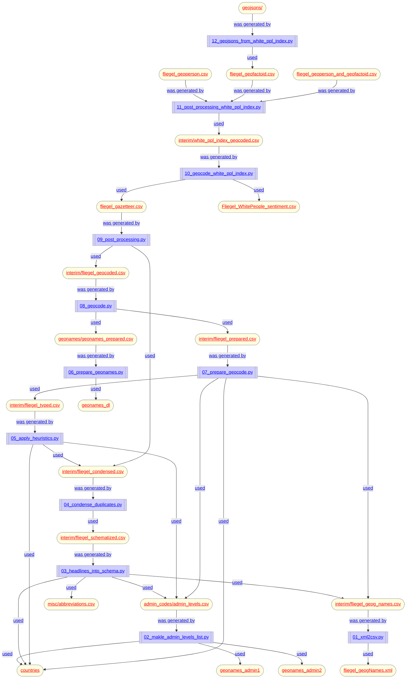

```mermaid
flowchart TD
classDef entity fill:#fffedf
classDef entity color:#000000
classDef entity stroke:#a4a4a4
classDef entity stroke-width:1px
classDef activity fill:#cfceff
classDef activity color:#000000
classDef activity stroke:#a4a4a4
classDef activity stroke-width:1px
classDef agent fill:#ffebc3
classDef agent color:#000000
classDef agent stroke:#a4a4a4
classDef agent stroke-width:1px
https://github.com/rue-a/fliegel/tree/master/fliegel_geogNames.xml([<a href=https://github.com/rue-a/fliegel/tree/master/fliegel_geogNames.xml style=color:red style=text-decoration:none>fliegel_geogNames.xml</a>]):::entity
https://github.com/rue-a/fliegel/tree/master/interim/fliegel_geog_names.csv([<a href=https://github.com/rue-a/fliegel/tree/master/interim/fliegel_geog_names.csv style=color:red style=text-decoration:none>interim/fliegel_geog_names.csv</a>]):::entity
https://github.com/rue-a/fliegel/tree/master/interim/fliegel_geog_names.csv-- <a href=https://www.w3.org/TR/prov-o/#wasGeneratedBy>was generated by</a> -->https://github.com/rue-a/fliegel/tree/master/01_xml2csv.py
https://github.com/rue-a/fliegel/tree/master/admin_codes/downloads/countries.csv([<a href=https://github.com/rue-a/fliegel/tree/master/admin_codes/downloads/countries.csv style=color:red style=text-decoration:none>countries</a>]):::entity
https://github.com/rue-a/fliegel/tree/master/admin_codes/downloads/geonames_admin1CodesASCII.csv([<a href=https://github.com/rue-a/fliegel/tree/master/admin_codes/downloads/geonames_admin1CodesASCII.csv style=color:red style=text-decoration:none>geonames_admin1</a>]):::entity
https://github.com/rue-a/fliegel/tree/master/admin_codes/downloads/geonames_admin2Codes.csv([<a href=https://github.com/rue-a/fliegel/tree/master/admin_codes/downloads/geonames_admin2Codes.csv style=color:red style=text-decoration:none>geonames_admin2</a>]):::entity
https://github.com/rue-a/fliegel/tree/master/admin_codes/admin_levels.csv([<a href=https://github.com/rue-a/fliegel/tree/master/admin_codes/admin_levels.csv style=color:red style=text-decoration:none>admin_codes/admin_levels.csv</a>]):::entity
https://github.com/rue-a/fliegel/tree/master/admin_codes/admin_levels.csv-- <a href=https://www.w3.org/TR/prov-o/#wasGeneratedBy>was generated by</a> -->https://github.com/rue-a/fliegel/tree/master/02_makle_admin_levels_list.py
https://github.com/rue-a/fliegel/tree/master/misc/abbreviations.csv([<a href=https://github.com/rue-a/fliegel/tree/master/misc/abbreviations.csv style=color:red style=text-decoration:none>misc/abbreviations.csv</a>]):::entity
https://github.com/rue-a/fliegel/tree/master/interim/fliegel_schematized.csv([<a href=https://github.com/rue-a/fliegel/tree/master/interim/fliegel_schematized.csv style=color:red style=text-decoration:none>interim/fliegel_schematized.csv</a>]):::entity
https://github.com/rue-a/fliegel/tree/master/interim/fliegel_schematized.csv-- <a href=https://www.w3.org/TR/prov-o/#wasGeneratedBy>was generated by</a> -->https://github.com/rue-a/fliegel/tree/master/03_headlines_into_schema.py
https://github.com/rue-a/fliegel/tree/master/interim/fliegel_condensed.csv([<a href=https://github.com/rue-a/fliegel/tree/master/interim/fliegel_condensed.csv style=color:red style=text-decoration:none>interim/fliegel_condensed.csv</a>]):::entity
https://github.com/rue-a/fliegel/tree/master/interim/fliegel_condensed.csv-- <a href=https://www.w3.org/TR/prov-o/#wasGeneratedBy>was generated by</a> -->https://github.com/rue-a/fliegel/tree/master/04_condense_duplicates.py
https://github.com/rue-a/fliegel/tree/master/interim/fliegel_typed.csv([<a href=https://github.com/rue-a/fliegel/tree/master/interim/fliegel_typed.csv style=color:red style=text-decoration:none>interim/fliegel_typed.csv</a>]):::entity
https://github.com/rue-a/fliegel/tree/master/interim/fliegel_typed.csv-- <a href=https://www.w3.org/TR/prov-o/#wasGeneratedBy>was generated by</a> -->https://github.com/rue-a/fliegel/tree/master/05_apply_heuristics.py
https://download.geonames.org/export/dump/bcd0b924-70a3-45b8-9b18-e357faa0a97a([<a href=https://download.geonames.org/export/dump/bcd0b924-70a3-45b8-9b18-e357faa0a97a style=color:red style=text-decoration:none>geonames_dl</a>]):::entity
https://github.com/rue-a/fliegel/tree/master/geonames/geonames_prepared.csv([<a href=https://github.com/rue-a/fliegel/tree/master/geonames/geonames_prepared.csv style=color:red style=text-decoration:none>geonames/geonames_prepared.csv</a>]):::entity
https://github.com/rue-a/fliegel/tree/master/geonames/geonames_prepared.csv-- <a href=https://www.w3.org/TR/prov-o/#wasGeneratedBy>was generated by</a> -->https://github.com/rue-a/fliegel/tree/master/06_prepare_geonames.py
https://github.com/rue-a/fliegel/tree/master/interim/fliegel_prepared.csv([<a href=https://github.com/rue-a/fliegel/tree/master/interim/fliegel_prepared.csv style=color:red style=text-decoration:none>interim/fliegel_prepared.csv</a>]):::entity
https://github.com/rue-a/fliegel/tree/master/interim/fliegel_prepared.csv-- <a href=https://www.w3.org/TR/prov-o/#wasGeneratedBy>was generated by</a> -->https://github.com/rue-a/fliegel/tree/master/07_prepare_geocode.py
https://github.com/rue-a/fliegel/tree/master/interim/fliegel_geocoded.csv([<a href=https://github.com/rue-a/fliegel/tree/master/interim/fliegel_geocoded.csv style=color:red style=text-decoration:none>interim/fliegel_geocoded.csv</a>]):::entity
https://github.com/rue-a/fliegel/tree/master/interim/fliegel_geocoded.csv-- <a href=https://www.w3.org/TR/prov-o/#wasGeneratedBy>was generated by</a> -->https://github.com/rue-a/fliegel/tree/master/08_geocode.py
https://github.com/rue-a/fliegel/tree/master/fliegel_gazetteer.csv([<a href=https://github.com/rue-a/fliegel/tree/master/fliegel_gazetteer.csv style=color:red style=text-decoration:none>fliegel_gazetteer.csv</a>]):::entity
https://github.com/rue-a/fliegel/tree/master/fliegel_gazetteer.csv-- <a href=https://www.w3.org/TR/prov-o/#wasGeneratedBy>was generated by</a> -->https://github.com/rue-a/fliegel/tree/master/09_post_processing.py
https://github.com/rue-a/fliegel/tree/master/Fliegel_WhitePeople_sentiment.csv([<a href=https://github.com/rue-a/fliegel/tree/master/Fliegel_WhitePeople_sentiment.csv style=color:red style=text-decoration:none>Fliegel_WhitePeople_sentiment.csv</a>]):::entity
https://github.com/rue-a/fliegel/tree/master/interim/white_ppl_index_geocoded.csv([<a href=https://github.com/rue-a/fliegel/tree/master/interim/white_ppl_index_geocoded.csv style=color:red style=text-decoration:none>interim/white_ppl_index_geocoded.csv</a>]):::entity
https://github.com/rue-a/fliegel/tree/master/interim/white_ppl_index_geocoded.csv-- <a href=https://www.w3.org/TR/prov-o/#wasGeneratedBy>was generated by</a> -->https://github.com/rue-a/fliegel/tree/master/10_geocode_white_ppl_index.py
https://github.com/rue-a/fliegel/tree/master/fliegel_geoperson.csv([<a href=https://github.com/rue-a/fliegel/tree/master/fliegel_geoperson.csv style=color:red style=text-decoration:none>fliegel_geoperson.csv</a>]):::entity
https://github.com/rue-a/fliegel/tree/master/fliegel_geoperson.csv-- <a href=https://www.w3.org/TR/prov-o/#wasGeneratedBy>was generated by</a> -->https://github.com/rue-a/fliegel/tree/master/11_post_processing_white_ppl_index.py
https://github.com/rue-a/fliegel/tree/master/fliegel_geofactoid.csv([<a href=https://github.com/rue-a/fliegel/tree/master/fliegel_geofactoid.csv style=color:red style=text-decoration:none>fliegel_geofactoid.csv</a>]):::entity
https://github.com/rue-a/fliegel/tree/master/fliegel_geofactoid.csv-- <a href=https://www.w3.org/TR/prov-o/#wasGeneratedBy>was generated by</a> -->https://github.com/rue-a/fliegel/tree/master/11_post_processing_white_ppl_index.py
https://github.com/rue-a/fliegel/tree/master/fliegel_geoperson_and_geofactoid.csv([<a href=https://github.com/rue-a/fliegel/tree/master/fliegel_geoperson_and_geofactoid.csv style=color:red style=text-decoration:none>fliegel_geoperson_and_geofactoid.csv</a>]):::entity
https://github.com/rue-a/fliegel/tree/master/fliegel_geoperson_and_geofactoid.csv-- <a href=https://www.w3.org/TR/prov-o/#wasGeneratedBy>was generated by</a> -->https://github.com/rue-a/fliegel/tree/master/11_post_processing_white_ppl_index.py
https://github.com/rue-a/fliegel/tree/master/geojsons/([<a href=https://github.com/rue-a/fliegel/tree/master/geojsons/ style=color:red style=text-decoration:none>geojsons/</a>]):::entity
https://github.com/rue-a/fliegel/tree/master/geojsons/-- <a href=https://www.w3.org/TR/prov-o/#wasGeneratedBy>was generated by</a> -->https://github.com/rue-a/fliegel/tree/master/12_geojsons_from_white_ppl_index.py
https://github.com/rue-a/fliegel/tree/master/01_xml2csv.py[[<a href=https://github.com/rue-a/fliegel/tree/master/01_xml2csv.py>01_xml2csv.py</a>]]:::activity
https://github.com/rue-a/fliegel/tree/master/01_xml2csv.py-- <a href=https://www.w3.org/TR/prov-o/#used>used</a> -->https://github.com/rue-a/fliegel/tree/master/fliegel_geogNames.xml
https://github.com/rue-a/fliegel/tree/master/02_makle_admin_levels_list.py[[<a href=https://github.com/rue-a/fliegel/tree/master/02_makle_admin_levels_list.py>02_makle_admin_levels_list.py</a>]]:::activity
https://github.com/rue-a/fliegel/tree/master/02_makle_admin_levels_list.py-- <a href=https://www.w3.org/TR/prov-o/#used>used</a> -->https://github.com/rue-a/fliegel/tree/master/admin_codes/downloads/countries.csv
https://github.com/rue-a/fliegel/tree/master/02_makle_admin_levels_list.py-- <a href=https://www.w3.org/TR/prov-o/#used>used</a> -->https://github.com/rue-a/fliegel/tree/master/admin_codes/downloads/geonames_admin1CodesASCII.csv
https://github.com/rue-a/fliegel/tree/master/02_makle_admin_levels_list.py-- <a href=https://www.w3.org/TR/prov-o/#used>used</a> -->https://github.com/rue-a/fliegel/tree/master/admin_codes/downloads/geonames_admin2Codes.csv
https://github.com/rue-a/fliegel/tree/master/03_headlines_into_schema.py[[<a href=https://github.com/rue-a/fliegel/tree/master/03_headlines_into_schema.py>03_headlines_into_schema.py</a>]]:::activity
https://github.com/rue-a/fliegel/tree/master/03_headlines_into_schema.py-- <a href=https://www.w3.org/TR/prov-o/#used>used</a> -->https://github.com/rue-a/fliegel/tree/master/misc/abbreviations.csv
https://github.com/rue-a/fliegel/tree/master/03_headlines_into_schema.py-- <a href=https://www.w3.org/TR/prov-o/#used>used</a> -->https://github.com/rue-a/fliegel/tree/master/admin_codes/admin_levels.csv
https://github.com/rue-a/fliegel/tree/master/03_headlines_into_schema.py-- <a href=https://www.w3.org/TR/prov-o/#used>used</a> -->https://github.com/rue-a/fliegel/tree/master/admin_codes/downloads/countries.csv
https://github.com/rue-a/fliegel/tree/master/03_headlines_into_schema.py-- <a href=https://www.w3.org/TR/prov-o/#used>used</a> -->https://github.com/rue-a/fliegel/tree/master/interim/fliegel_geog_names.csv
https://github.com/rue-a/fliegel/tree/master/04_condense_duplicates.py[[<a href=https://github.com/rue-a/fliegel/tree/master/04_condense_duplicates.py>04_condense_duplicates.py</a>]]:::activity
https://github.com/rue-a/fliegel/tree/master/04_condense_duplicates.py-- <a href=https://www.w3.org/TR/prov-o/#used>used</a> -->https://github.com/rue-a/fliegel/tree/master/interim/fliegel_schematized.csv
https://github.com/rue-a/fliegel/tree/master/05_apply_heuristics.py[[<a href=https://github.com/rue-a/fliegel/tree/master/05_apply_heuristics.py>05_apply_heuristics.py</a>]]:::activity
https://github.com/rue-a/fliegel/tree/master/05_apply_heuristics.py-- <a href=https://www.w3.org/TR/prov-o/#used>used</a> -->https://github.com/rue-a/fliegel/tree/master/interim/fliegel_condensed.csv
https://github.com/rue-a/fliegel/tree/master/05_apply_heuristics.py-- <a href=https://www.w3.org/TR/prov-o/#used>used</a> -->https://github.com/rue-a/fliegel/tree/master/admin_codes/downloads/countries.csv
https://github.com/rue-a/fliegel/tree/master/05_apply_heuristics.py-- <a href=https://www.w3.org/TR/prov-o/#used>used</a> -->https://github.com/rue-a/fliegel/tree/master/admin_codes/admin_levels.csv
https://github.com/rue-a/fliegel/tree/master/06_prepare_geonames.py[[<a href=https://github.com/rue-a/fliegel/tree/master/06_prepare_geonames.py>06_prepare_geonames.py</a>]]:::activity
https://github.com/rue-a/fliegel/tree/master/06_prepare_geonames.py-- <a href=https://www.w3.org/TR/prov-o/#used>used</a> -->https://download.geonames.org/export/dump/bcd0b924-70a3-45b8-9b18-e357faa0a97a
https://github.com/rue-a/fliegel/tree/master/07_prepare_geocode.py[[<a href=https://github.com/rue-a/fliegel/tree/master/07_prepare_geocode.py>07_prepare_geocode.py</a>]]:::activity
https://github.com/rue-a/fliegel/tree/master/07_prepare_geocode.py-- <a href=https://www.w3.org/TR/prov-o/#used>used</a> -->https://github.com/rue-a/fliegel/tree/master/interim/fliegel_typed.csv
https://github.com/rue-a/fliegel/tree/master/07_prepare_geocode.py-- <a href=https://www.w3.org/TR/prov-o/#used>used</a> -->https://github.com/rue-a/fliegel/tree/master/admin_codes/admin_levels.csv
https://github.com/rue-a/fliegel/tree/master/07_prepare_geocode.py-- <a href=https://www.w3.org/TR/prov-o/#used>used</a> -->https://github.com/rue-a/fliegel/tree/master/admin_codes/downloads/countries.csv
https://github.com/rue-a/fliegel/tree/master/07_prepare_geocode.py-- <a href=https://www.w3.org/TR/prov-o/#used>used</a> -->https://github.com/rue-a/fliegel/tree/master/interim/fliegel_geog_names.csv
https://github.com/rue-a/fliegel/tree/master/08_geocode.py[[<a href=https://github.com/rue-a/fliegel/tree/master/08_geocode.py>08_geocode.py</a>]]:::activity
https://github.com/rue-a/fliegel/tree/master/08_geocode.py-- <a href=https://www.w3.org/TR/prov-o/#used>used</a> -->https://github.com/rue-a/fliegel/tree/master/interim/fliegel_prepared.csv
https://github.com/rue-a/fliegel/tree/master/08_geocode.py-- <a href=https://www.w3.org/TR/prov-o/#used>used</a> -->https://github.com/rue-a/fliegel/tree/master/geonames/geonames_prepared.csv
https://github.com/rue-a/fliegel/tree/master/09_post_processing.py[[<a href=https://github.com/rue-a/fliegel/tree/master/09_post_processing.py>09_post_processing.py</a>]]:::activity
https://github.com/rue-a/fliegel/tree/master/09_post_processing.py-- <a href=https://www.w3.org/TR/prov-o/#used>used</a> -->https://github.com/rue-a/fliegel/tree/master/interim/fliegel_geocoded.csv
https://github.com/rue-a/fliegel/tree/master/09_post_processing.py-- <a href=https://www.w3.org/TR/prov-o/#used>used</a> -->https://github.com/rue-a/fliegel/tree/master/interim/fliegel_condensed.csv
https://github.com/rue-a/fliegel/tree/master/10_geocode_white_ppl_index.py[[<a href=https://github.com/rue-a/fliegel/tree/master/10_geocode_white_ppl_index.py>10_geocode_white_ppl_index.py</a>]]:::activity
https://github.com/rue-a/fliegel/tree/master/10_geocode_white_ppl_index.py-- <a href=https://www.w3.org/TR/prov-o/#used>used</a> -->https://github.com/rue-a/fliegel/tree/master/fliegel_gazetteer.csv
https://github.com/rue-a/fliegel/tree/master/10_geocode_white_ppl_index.py-- <a href=https://www.w3.org/TR/prov-o/#used>used</a> -->https://github.com/rue-a/fliegel/tree/master/Fliegel_WhitePeople_sentiment.csv
https://github.com/rue-a/fliegel/tree/master/11_post_processing_white_ppl_index.py[[<a href=https://github.com/rue-a/fliegel/tree/master/11_post_processing_white_ppl_index.py>11_post_processing_white_ppl_index.py</a>]]:::activity
https://github.com/rue-a/fliegel/tree/master/11_post_processing_white_ppl_index.py-- <a href=https://www.w3.org/TR/prov-o/#used>used</a> -->https://github.com/rue-a/fliegel/tree/master/interim/white_ppl_index_geocoded.csv
https://github.com/rue-a/fliegel/tree/master/12_geojsons_from_white_ppl_index.py[[<a href=https://github.com/rue-a/fliegel/tree/master/12_geojsons_from_white_ppl_index.py>12_geojsons_from_white_ppl_index.py</a>]]:::activity
https://github.com/rue-a/fliegel/tree/master/12_geojsons_from_white_ppl_index.py-- <a href=https://www.w3.org/TR/prov-o/#used>used</a> -->https://github.com/rue-a/fliegel/tree/master/fliegel_geofactoid.csv
```